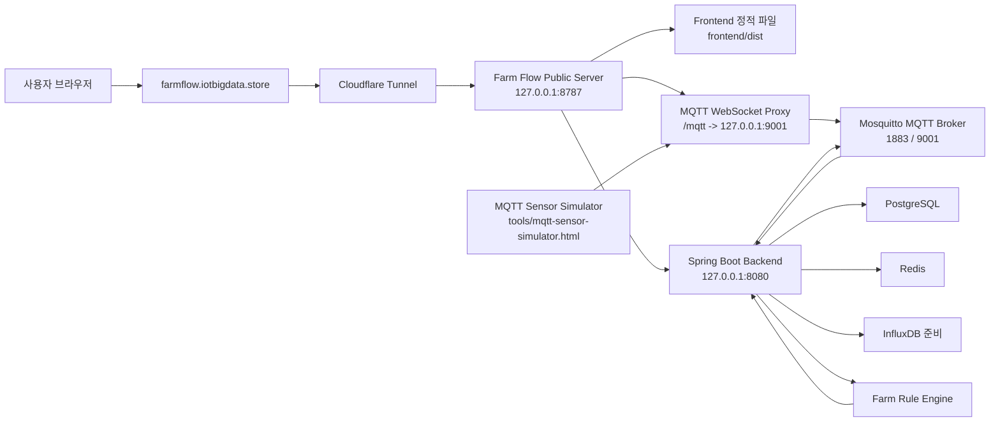
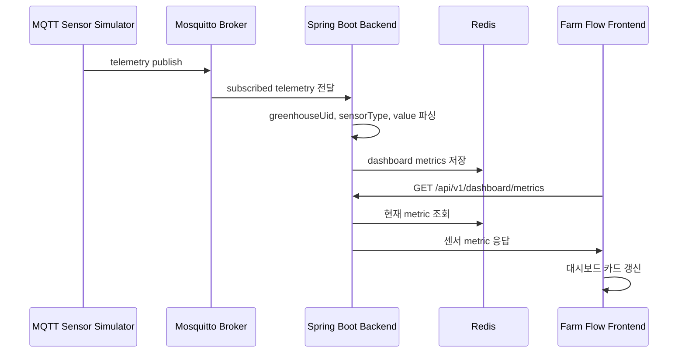
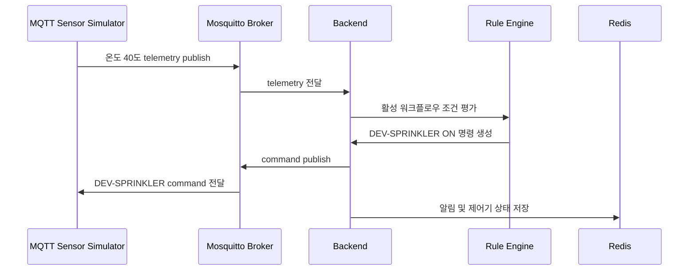
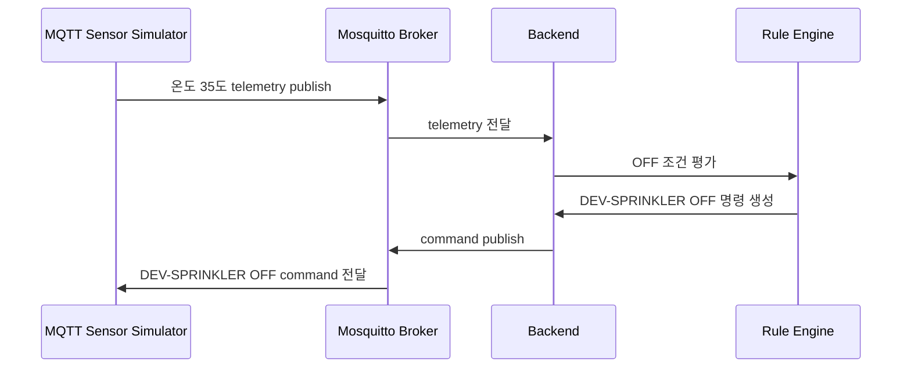

# FARM FLOW 최종 종합 보고서

## 1. 문서 목적

이 문서는 최종 보고서 작성과 발표자료 제작을 위해 Farm Flow 프로젝트의 전체 구성, 주요 기능, 시뮬레이터 역할, 백엔드/프론트엔드 처리 흐름, MQTT 기반 센서 시연 구조, 배포 방식, 자동 실행 구조를 하나의 종합 Markdown 문서로 정리한 것이다.

Farm Flow는 스마트팜 환경을 웹에서 모니터링하고, 센서 데이터에 따라 제어기를 자동 동작시키는 통합 관리 시스템이다. 최종 구현에서는 실제 센서 장비가 없어도 MQTT 기반 센서 시뮬레이터를 이용해 온도, 습도, CO2, 조도 값을 발생시키고, Farm Flow 대시보드와 로직빌더, 룰 엔진, 제어기 상태 변화까지 하나의 시연 흐름으로 확인할 수 있게 구성했다.

## 2. 프로젝트 한 줄 요약

Farm Flow는 사용자별 온실 UID를 기준으로 센서, 장치, 워크플로우 데이터를 분리하고, MQTT 센서 시뮬레이터와 룰 엔진을 통해 실시간 모니터링 및 자동 제어를 시연할 수 있는 스마트팜 통합 관리 웹 시스템이다.

## 3. 전체 시스템 구성

Farm Flow 최종 구조는 크게 다음 요소로 구성된다.

| 구성 요소 | 역할 |
| --- | --- |
| Frontend | 사용자가 접속하는 웹 화면. 로그인, 대시보드, 장치 등록, 로직빌더, 템플릿, 스케줄러, 알림센터 제공 |
| Backend | 인증, 사용자/온실 관리, 장치 관리, 워크플로우 저장, 템플릿 적용, MQTT 수신, 룰 엔진 실행 담당 |
| PostgreSQL | 사용자, 장치, 워크플로우, 템플릿 등 영속 데이터 저장 |
| Redis | 로그인 세션, 실시간 대시보드 센서 상태, 알림 상태 저장 |
| InfluxDB | 시계열 센서 데이터 확장을 위해 Docker 구성에 포함된 인프라 |
| Mosquitto MQTT Broker | 센서 시뮬레이터와 백엔드가 MQTT 메시지를 주고받는 브로커 |
| MQTT Sensor Simulator | 실제 센서 대신 브라우저에서 센서값을 조정하고 MQTT telemetry를 발행하는 시연 도구 |
| Farm Flow Public Server | 프론트 정적 파일 제공, 백엔드 API 프록시, MQTT WebSocket 프록시, health check 제공 |
| Cloudflare Tunnel | 로컬 PC에서 실행 중인 Farm Flow를 외부 도메인으로 접속 가능하게 연결 |
| Auto Start Script | PC 부팅 후 Docker, 백엔드, public server, Cloudflare Tunnel을 자동 실행 |

## 4. 전체 아키텍처



위 구조에서 핵심은 사용자가 웹 화면에서 장치와 로직을 설정하고, 시뮬레이터가 MQTT로 센서 데이터를 보내면, 백엔드가 이를 수신하여 Redis에 실시간 상태를 저장하고 룰 엔진을 통해 제어 명령을 다시 MQTT로 발행한다는 점이다.

## 5. 사용자 기준 주요 흐름

### 5.1 회원가입 및 로그인

사용자는 Farm Flow 웹에서 회원가입을 진행한다. 회원가입 시 백엔드는 사용자 계정을 생성하고, 각 사용자에게 고유한 온실 UID인 `greenhouseUid`를 발급한다.

이 온실 UID는 이후 센서 데이터, 장치 등록, 워크플로우, 알림을 사용자별로 분리하는 기준이 된다.

흐름은 다음과 같다.

1. 사용자가 회원가입 화면에서 이메일, 비밀번호, 이름을 입력한다.
2. 프론트엔드는 `/api/v1/auth/signup` API를 호출한다.
3. 백엔드는 비밀번호를 해시 처리하여 저장한다.
4. 백엔드는 사용자 UID와 온실 UID를 생성한다.
5. 백엔드는 JWT 토큰과 사용자 정보를 프론트로 반환한다.
6. 프론트는 토큰과 `greenhouseUid`를 localStorage에 저장한다.
7. 이후 장치 등록, 대시보드, 로직빌더 API 호출은 해당 온실 UID 기준으로 동작한다.

관련 주요 파일은 다음과 같다.

| 파일 | 역할 |
| --- | --- |
| `frontend/src/page/Login.tsx` | 로그인 화면 |
| `frontend/src/page/Sign.tsx` | 회원가입 화면 |
| `frontend/src/api/api.ts` | signup/login API 호출, 토큰 및 온실 UID 저장 |
| `backend/src/main/java/com/backend/controller/AuthController.java` | 인증 관련 API 엔드포인트 |
| `backend/src/main/java/com/backend/service/AuthService.java` | 회원가입, 로그인, 토큰 발급, 세션 저장 |
| `backend/src/main/java/com/backend/entity/User.java` | 사용자 엔티티 |
| `backend/src/main/java/com/backend/security/JwtFilter.java` | JWT 인증 필터 |
| `backend/src/main/java/com/backend/security/JwtUtil.java` | JWT 생성 및 검증 |

### 5.2 사용자별 온실 UID 분리

Farm Flow에서 여러 명의 사용자가 동시에 접속하거나, 여러 개의 센서 시뮬레이터를 실행하는 경우 데이터가 섞이면 시연과 실제 서비스 모두에서 문제가 된다. 이를 해결하기 위해 최종 구조에서는 `greenhouseUid`를 중심으로 데이터를 분리한다.

예를 들어 A 사용자의 온실 UID가 `GH-ABC123`이고, B 사용자의 온실 UID가 `GH-XYZ789`라면 MQTT topic도 다음처럼 분리된다.

```text
farmflow/greenhouses/GH-ABC123/devices/DEV-TEMP/telemetry
farmflow/greenhouses/GH-XYZ789/devices/DEV-TEMP/telemetry
```

같은 `DEV-TEMP` 장치 UID를 사용하더라도 온실 UID가 다르면 서로 다른 온실의 센서 데이터로 처리된다.

이 구조의 장점은 다음과 같다.

- 여러 사용자가 같은 서버에 접속해도 각자 독립된 센서 데이터를 볼 수 있다.
- 시뮬레이터를 여러 개 켜도 온실 UID만 다르게 입력하면 별도의 온실처럼 시연할 수 있다.
- 장치 등록, 로직빌더, 대시보드가 같은 기준인 `greenhouseUid`로 연결된다.

## 6. Farm Flow 웹 기능 상세

## 6.1 대시보드

대시보드는 Farm Flow의 현재 온실 상태를 한눈에 확인하는 화면이다.

주요 역할은 다음과 같다.

- 온도, 습도, CO2, 조도 센서 값 표시
- 센서 값의 상태 판단
- 제어기 동작 상태 확인
- 룰 엔진에 의해 발생한 알림 표시
- 사용자가 알림을 확인하면 알림센터에서 제거
- MQTT 시뮬레이터로 값이 변경되면 화면에 반영

대시보드는 백엔드의 `/api/v1/dashboard/metrics`와 `/api/v1/dashboard/alerts`를 통해 데이터를 가져온다.

센서 metric 예시는 다음과 같은 형태로 표시된다.

| 센서 | 단위 | 의미 |
| --- | --- | --- |
| 온도 | `°C` | 온실 내부 온도 |
| 습도 | `%` | 온실 내부 상대 습도 |
| CO2 | `ppm` | 이산화탄소 농도 |
| 조도 | `lux` | 광량 |

관련 주요 파일은 다음과 같다.

| 파일 | 역할 |
| --- | --- |
| `frontend/src/page/Dashboard.tsx` | 대시보드 페이지 |
| `frontend/src/components/Dashboard/MetricsSection.tsx` | 센서 지표 카드 |
| `frontend/src/components/Dashboard/WeatherSection.tsx` | 환경/날씨 정보 영역 |
| `frontend/src/components/Layout.tsx` | 알림센터와 공통 레이아웃 |
| `backend/src/main/java/com/backend/controller/DashboardController.java` | 대시보드 metric/alert API |
| `backend/src/main/java/com/backend/mqtt/MqttPipeline.java` | MQTT 센서 수신 후 대시보드 상태 저장 |

## 6.2 장치 등록

장치 등록 화면은 사용자가 온실에 연결할 센서 또는 제어기를 등록하는 기능을 담당한다.

최종 구현에서 장치는 크게 두 종류로 볼 수 있다.

| 장치 종류 | 예시 | 역할 |
| --- | --- | --- |
| 센서 | 온도 센서, 습도 센서, CO2 센서, 조도 센서 | 환경 데이터를 측정하고 MQTT telemetry로 전송 |
| 제어기 | 환기팬, 스프링클러, 보광등 | 룰 엔진 또는 사용자 제어에 의해 ON/OFF 명령 수신 |

장치 등록 시 핵심 입력값은 다음과 같다.

| 입력값 | 설명 |
| --- | --- |
| 장치 이름 | 사용자가 화면에서 구분하기 위한 이름 |
| 장치 UID | MQTT topic과 연결되는 장치 식별자 |
| 장치 타입 | 센서인지 제어기인지 구분 |
| 센서/제어기 세부 타입 | temperature, humidity, co2, light, fan, sprinkler, led 등 |
| 온실 UID | 로그인한 사용자에게 부여된 온실 UID |

장치를 등록해야 로직빌더에서 해당 센서나 제어기를 블록으로 활용할 수 있다. 즉 장치 등록은 MQTT 시뮬레이터와 로직빌더를 연결하는 중간 단계다.

관련 주요 파일은 다음과 같다.

| 파일 | 역할 |
| --- | --- |
| `frontend/src/page/DeviceRegistrationPage.tsx` | 장치 등록 화면 |
| `frontend/src/api/api.ts` | 장치 등록/조회/삭제 API |
| `backend/src/main/java/com/backend/controller/DeviceController.java` | 장치 API |
| `backend/src/main/java/com/backend/service/DeviceService.java` | 온실 UID 기준 장치 관리 |
| `backend/src/main/java/com/backend/entity/Device.java` | 장치 엔티티 |
| `backend/src/main/java/com/backend/repository/DeviceRepository.java` | 장치 조회 저장소 |

## 6.3 로직빌더

로직빌더는 사용자가 센서 조건과 제어기 동작을 직접 구성하는 시각적 워크플로우 편집 화면이다.

기본 구조는 다음 세 종류의 블록으로 나뉜다.

| 블록 | 설명 |
| --- | --- |
| 센서 블록 | 등록된 센서를 선택해 현재 센서 값을 기준으로 로직의 시작점이 됨 |
| 조건 블록 | 온도, 습도, CO2, 조도 등의 기준값과 비교 조건을 직접 입력 |
| 제어기 블록 | 조건이 만족되었을 때 실행할 제어기 명령을 설정 |

예시는 다음과 같다.

```text
온도 센서 -> 온도 > 30°C -> 환기팬 ON
온도 센서 -> 온도 <= 28°C -> 환기팬 OFF
CO2 센서 -> CO2 > 1000ppm -> 환기팬 ON
조도 센서 -> 조도 < 500lux -> 보광등 ON
```

로직빌더에서 중요한 점은 단순한 고정 자동화가 아니라 사용자가 조건값을 직접 입력할 수 있다는 것이다.

조건 블록에서 설정 가능한 대표 항목은 다음과 같다.

| 센서 항목 | 조건 예시 |
| --- | --- |
| 온도 | `temperature > 30`, `temperature <= 28` |
| 습도 | `humidity < 60`, `humidity > 80` |
| CO2 | `co2 > 1000` |
| 조도 | `light < 500` |

제어기 블록에서는 `ON` 또는 `OFF` 명령을 선택한다. 이를 통해 특정 조건에서는 제어기를 켜고, 조건이 해제되면 끄는 흐름을 만들 수 있다.

로직빌더가 저장하는 데이터는 React Flow의 노드와 엣지를 포함한 `flowData` 구조다. 백엔드는 이 flowData를 저장하고, MQTT 센서 데이터가 들어왔을 때 룰 엔진이 조건 노드와 액션 노드를 해석해 제어 명령을 발행한다.

관련 주요 파일은 다음과 같다.

| 파일 | 역할 |
| --- | --- |
| `frontend/src/page/LogicBuilderPage.tsx` | 로직빌더 화면과 노드/엣지 편집 |
| `frontend/src/flow/logicNodes.tsx` | 센서, 조건, 제어기 노드 UI |
| `frontend/src/api/api.ts` | 워크플로우 저장/수정/삭제/배포 API |
| `backend/src/main/java/com/backend/controller/WorkflowController.java` | 워크플로우 API |
| `backend/src/main/java/com/backend/service/WorkflowService.java` | 워크플로우 저장 및 배포 처리 |
| `backend/src/main/java/com/backend/mqtt/MqttPipeline.java` | 저장된 flowData를 MQTT 수신 시 평가 |

## 6.4 워크플로우 저장 및 배포

워크플로우는 로직빌더에서 만든 자동화 규칙을 저장한 단위다.

워크플로우의 역할은 다음과 같다.

- 로직빌더 노드/엣지 구조 저장
- 사용자별 자동화 규칙 관리
- 템플릿 적용 결과를 사용자 워크플로우로 저장
- 배포 상태를 통해 실제 룰 엔진 평가 대상 지정

워크플로우 관련 API는 다음과 같다.

| API | 역할 |
| --- | --- |
| `POST /api/v1/workflows` | 새 워크플로우 저장 |
| `GET /api/v1/workflows` | 내 워크플로우 목록 조회 |
| `GET /api/v1/workflows/{uid}` | 특정 워크플로우 조회 |
| `PUT /api/v1/workflows/{uid}` | 워크플로우 수정 |
| `DELETE /api/v1/workflows/{uid}` | 워크플로우 삭제 |
| `POST /api/v1/workflows/{uid}/deploy` | 워크플로우 활성화 |
| `POST /api/v1/workflows/{uid}/stop` | 워크플로우 비활성화 |

룰 엔진은 활성화된 워크플로우를 기준으로 센서 데이터를 평가한다.

## 6.5 템플릿

템플릿 기능은 자주 사용하는 스마트팜 자동화 로직을 미리 만들어 제공하는 기능이다.

최종 구현에서는 템플릿을 단순 카드가 아니라 실제 로직빌더에서 열 수 있는 flowData 구조로 구성했다.

템플릿의 주요 역할은 다음과 같다.

- 사용자가 처음부터 로직을 만들지 않아도 기본 자동화 예시를 사용할 수 있게 함
- 온도, 습도, 조도, CO2 등 센서 조건과 제어기 동작 예시 제공
- 등록된 장치가 있으면 템플릿 내부 장치 UID를 실제 장치 UID와 연결
- 템플릿 적용 시 사용자 워크플로우로 복사
- 필요 시 바로 배포하여 시연 가능

예시 템플릿은 다음과 같은 구조를 가진다.

```text
온도 센서 -> 온도 > 30°C -> 환기팬 ON
온도 센서 -> 온도 <= 28°C -> 환기팬 OFF
```

관련 주요 파일은 다음과 같다.

| 파일 | 역할 |
| --- | --- |
| `frontend/src/page/TemplatePage.tsx` | 템플릿 목록, 편집, 적용, 삭제 UI |
| `backend/src/main/java/com/backend/controller/TemplateController.java` | 템플릿 조회/적용 API |
| `backend/src/main/java/com/backend/service/TemplateService.java` | 템플릿 flowData 복사 및 워크플로우 생성 |
| `backend/src/main/java/com/backend/entity/Template.java` | 템플릿 엔티티 |
| `backend/src/main/java/com/backend/dto/TemplateResponse.java` | 템플릿 응답 DTO |

## 6.6 스케줄러

스케줄러는 온실 관리 일정을 등록하고 확인하는 기능이다.

최종 구현에서는 단순히 특정 시간 하나만 기록하는 형태가 아니라, 일정의 시작일과 종료일을 설정할 수 있도록 개선했다. 따라서 사용자는 여행 일정처럼 일정 기간을 정해 관리할 수 있다.

주요 기능은 다음과 같다.

- 일정 생성
- 일정 수정
- 일정 삭제
- 시작일과 종료일 기반 기간 일정 표시
- 24시간 일정이나 긴 일정의 타임라인 반영
- 오늘 일정과 달력 기반 일정 확인

관련 주요 파일은 다음과 같다.

| 파일 | 역할 |
| --- | --- |
| `frontend/src/page/Scheduler.tsx` | 스케줄러 페이지 |
| `frontend/src/components/Scheduler/AddScheduleModal.tsx` | 일정 등록 모달 |
| `frontend/src/components/Scheduler/EventModal.tsx` | 일정 상세/수정 모달 |
| `frontend/src/components/Scheduler/useSchedulerLogic.ts` | 일정 생성/수정/삭제 로직 |
| `frontend/src/components/Scheduler/types.ts` | 일정 데이터 타입 |
| `frontend/src/components/Scheduler/SchedulerData.ts` | 일정 데이터 구조 |

## 6.7 알림센터

알림센터는 룰 엔진에 의해 제어기가 동작하거나, 중요한 상태 변화가 발생했을 때 사용자에게 알려주는 영역이다.

최종 구현에서는 알림이 없는데도 사이드바가 강제로 노출되는 문제를 개선했다. 알림은 필요할 때 확인할 수 있고, 사용자가 확인하면 삭제하거나 상태에 따라 제거되도록 구성했다.

알림 발생 흐름은 다음과 같다.

1. MQTT 센서 데이터가 백엔드로 들어온다.
2. 룰 엔진이 조건을 평가한다.
3. 제어기 ON/OFF 명령이 발생한다.
4. 백엔드는 Redis에 알림 데이터를 기록한다.
5. 프론트 대시보드와 레이아웃이 알림을 조회한다.
6. 사용자가 알림을 확인하면 삭제 API를 호출한다.

관련 API는 다음과 같다.

| API | 역할 |
| --- | --- |
| `GET /api/v1/dashboard/alerts` | 알림 목록 조회 |
| `DELETE /api/v1/dashboard/alerts/{alertId}` | 알림 확인/삭제 |

## 7. 백엔드 상세 역할

## 7.1 인증 서버 역할

백엔드는 Farm Flow의 인증과 사용자 상태 관리를 담당한다. 사용자 비밀번호는 평문 저장이 아니라 해시 처리 후 저장되며, 로그인 시 JWT 토큰이 발급된다.

JWT 토큰은 이후 API 요청마다 Authorization header에 포함된다.

```text
Authorization: Bearer {token}
```

백엔드는 JWT를 검증하고 사용자 UID를 식별한 뒤, 해당 사용자의 온실 UID를 기준으로 장치, 워크플로우, 대시보드 데이터를 조회한다.

## 7.2 장치 관리 서버 역할

장치 관리는 Farm Flow와 MQTT 시뮬레이터를 연결하는 핵심 기능이다.

백엔드는 장치 등록 시 다음 정보를 관리한다.

- 장치 UID
- 온실 UID
- 장치 이름
- 센서 타입 또는 제어기 타입
- MQTT topic
- 장치 상태

장치 등록 후 프론트 로직빌더는 해당 장치 목록을 불러와 센서 블록 또는 제어기 블록으로 추가할 수 있다.

## 7.3 MQTT 파이프라인 역할

`MqttPipeline`은 MQTT 메시지가 Farm Flow 내부 기능으로 들어오는 핵심 통로다.

역할은 다음과 같다.

1. Mosquitto broker에서 telemetry topic 수신
2. topic 또는 payload에서 `greenhouseUid` 확인
3. sensorType과 value를 읽어 현재 센서 상태 갱신
4. Redis에 대시보드 metric 저장
5. 활성 워크플로우 조회
6. 조건 노드 평가
7. 조건을 만족하면 제어기 command topic으로 ON/OFF 발행
8. 제어 명령에 따른 알림 기록

지원 topic 예시는 다음과 같다.

```text
farm/sensor/#
farmflow/devices/{deviceUid}/telemetry
farmflow/greenhouses/{greenhouseUid}/devices/{deviceUid}/telemetry
```

제어 명령 topic 예시는 다음과 같다.

```text
farmflow/greenhouses/{greenhouseUid}/devices/{deviceUid}/command
```

## 7.4 룰 엔진 역할

룰 엔진은 센서 데이터를 기준으로 제어 명령을 판단하는 모듈이다.

기본 규칙은 온도, 습도, CO2, 조도 값을 평가한다. 또한 로직빌더에서 사용자가 저장한 flowData를 해석하여 조건 노드와 제어기 노드의 연결 관계를 판단한다.

룰 엔진의 대표 판단 예시는 다음과 같다.

| 조건 | 결과 |
| --- | --- |
| 온도 > 30°C | 환기팬 ON |
| 온도 <= 28°C | 환기팬 OFF |
| 습도 < 60% | 스프링클러 ON |
| 습도 >= 70% | 스프링클러 OFF |
| CO2 > 1000ppm | 환기팬 ON |
| 조도 < 500lux | 보광등 ON |

## 7.5 Redis 활용

Redis는 최종 시연에서 실시간 상태 저장소로 사용된다.

주요 저장 대상은 다음과 같다.

- 로그인 세션
- 온실별 현재 센서 metric
- 온실별 알림 목록
- 제어기별 마지막 명령 상태

Redis를 사용하면 센서 값이 계속 들어오는 상황에서도 빠르게 최신 상태를 조회할 수 있다.

## 7.6 PostgreSQL 활용

PostgreSQL은 영속 데이터를 저장한다.

저장 대상은 다음과 같다.

- 사용자 계정
- 온실 UID
- 장치 정보
- 워크플로우
- 워크플로우 배포 상태
- 템플릿

즉 PostgreSQL은 사용자가 직접 만든 설정과 계정 데이터를 유지하는 역할을 한다.

## 8. 프론트엔드 상세 역할

## 8.1 API 계층

프론트엔드의 `frontend/src/api/api.ts`는 화면과 백엔드 사이의 연결 계층이다.

담당 기능은 다음과 같다.

- API base URL 관리
- JWT token 저장/삭제
- greenhouseUid 저장/삭제
- 인증 요청에 Authorization header 자동 추가
- 회원가입/로그인/로그아웃 API
- 장치 등록/조회/삭제 API
- 워크플로우 저장/배포 API
- 템플릿 조회/적용 API
- 대시보드 metric/alert API

Cloudflare 배포 환경에서는 `VITE_API_BASE_URL=/api/v1`로 빌드하여, 같은 도메인에서 `/api/v1` 요청이 public server를 통해 백엔드로 프록시된다.

## 8.2 화면 라우팅

Farm Flow 주요 화면은 다음과 같다.

| 화면 | 경로 | 역할 |
| --- | --- | --- |
| 로그인 | `/login` | 사용자 로그인 |
| 회원가입 | `/signup` | 사용자 계정 생성 |
| 대시보드 | `/dashboard` | 센서 상태와 알림 확인 |
| 장치 등록 | `/devices` | 센서/제어기 등록 |
| 로직빌더 | `/logic-builder` | 자동화 워크플로우 구성 |
| 템플릿 | `/templates` | 기본 워크플로우 템플릿 적용 |
| 스케줄러 | `/scheduler` | 온실 관리 일정 등록 |

## 8.3 상태 관리

프론트엔드는 localStorage에 다음 정보를 저장한다.

| 키 | 의미 |
| --- | --- |
| `token` | JWT 인증 토큰 |
| `farmflow.greenhouseUid` | 현재 사용자의 온실 UID |

이 값은 새로고침 후에도 로그인 상태와 온실 UID를 유지하기 위해 사용된다.

## 9. MQTT Sensor Simulator 상세

## 9.1 시뮬레이터의 목적

`tools/mqtt-sensor-simulator.html`은 실제 하드웨어 센서가 없어도 MQTT 기반 센서 연동을 시연하기 위해 만든 브라우저 기반 도구다.

실제 스마트팜에서는 온도 센서, 습도 센서, CO2 센서, 조도 센서가 라즈베리파이, 아두이노, ESP32 같은 장치에 연결되고, 해당 장치가 MQTT broker로 데이터를 전송한다. 이번 프로젝트에서는 실제 센서 장비가 없어도 같은 구조를 재현하기 위해 웹 기반 시뮬레이터를 만들었다.

즉 시뮬레이터는 실제 센서 장비의 대체 역할을 한다.

## 9.2 시뮬레이터가 제공하는 센서

시뮬레이터는 네 가지 센서 값을 조정할 수 있다.

| 센서 | 기본 UID 예시 | 단위 | 역할 |
| --- | --- | --- | --- |
| 온도 센서 | `DEV-TEMP` | `C` | 온실 내부 온도 전송 |
| 습도 센서 | `DEV-HUMIDITY` | `%` | 온실 내부 습도 전송 |
| CO2 센서 | `DEV-CO2` | `ppm` | 이산화탄소 농도 전송 |
| 조도 센서 | `DEV-LIGHT` | `lux` | 광량 전송 |

사용자는 슬라이더나 입력값을 통해 센서값을 바꿀 수 있고, 변경된 값은 MQTT telemetry 메시지로 발행된다.

## 9.3 시뮬레이터가 제공하는 제어기

시뮬레이터는 제어 명령을 수신하는 세 가지 제어기도 표현한다.

| 제어기 | 기본 UID | 역할 |
| --- | --- | --- |
| 환기팬 | `DEV-FAN` | 온도나 CO2가 높을 때 환기 |
| 스프링클러 | `DEV-SPRINKLER` | 온도가 높거나 습도가 낮을 때 물 분사 |
| 보광등 | `DEV-LED` | 조도가 낮을 때 보조 조명 |

각 제어기는 command topic을 구독한다. 백엔드 룰 엔진이 조건에 따라 `ON` 또는 `OFF` 명령을 발행하면 시뮬레이터 화면에서 해당 제어기의 상태가 바뀐다.

## 9.4 온실 UID 입력 방식

시뮬레이터에서 가장 중요한 입력값은 온실 UID다.

사용자는 Farm Flow 웹에서 로그인 후 자신의 온실 UID를 확인하고, 시뮬레이터의 온실 UID 입력칸에 같은 값을 입력해야 한다.

예를 들어 온실 UID가 `GH-ABCD12`라면 시뮬레이터는 다음 topic으로 메시지를 보낸다.

```text
farmflow/greenhouses/GH-ABCD12/devices/DEV-TEMP/telemetry
farmflow/greenhouses/GH-ABCD12/devices/DEV-HUMIDITY/telemetry
farmflow/greenhouses/GH-ABCD12/devices/DEV-CO2/telemetry
farmflow/greenhouses/GH-ABCD12/devices/DEV-LIGHT/telemetry
```

제어 명령 수신 topic은 다음과 같다.

```text
farmflow/greenhouses/GH-ABCD12/devices/DEV-FAN/command
farmflow/greenhouses/GH-ABCD12/devices/DEV-SPRINKLER/command
farmflow/greenhouses/GH-ABCD12/devices/DEV-LED/command
```

이 구조 때문에 여러 명이 동시에 시연해도 각자의 온실 UID만 다르게 입력하면 데이터가 서로 분리된다.

## 9.5 telemetry payload 구조

시뮬레이터가 발행하는 telemetry 메시지는 다음과 같은 구조를 가진다.

```json
{
  "deviceUid": "DEV-TEMP",
  "sensorType": "temperature",
  "value": 31.5,
  "unit": "C",
  "greenhouse": "GH-ABCD12",
  "greenhouseUid": "GH-ABCD12",
  "timestamp": "2026-06-03T10:00:00.000Z"
}
```

필드 의미는 다음과 같다.

| 필드 | 의미 |
| --- | --- |
| `deviceUid` | 센서 장치 식별자 |
| `sensorType` | temperature, humidity, co2, light 중 하나 |
| `value` | 센서 측정값 |
| `unit` | 센서 단위 |
| `greenhouse` | 온실 UID |
| `greenhouseUid` | 온실 UID |
| `timestamp` | 메시지 발행 시각 |

## 9.6 command payload 구조

백엔드가 제어기로 발행하는 command 메시지는 다음과 같은 구조다.

```json
{
  "deviceUid": "DEV-FAN",
  "command": "ON",
  "source": "rule-engine",
  "reason": "temperature > 30",
  "issuedAt": "2026-06-03T10:00:00+09:00"
}
```

필드 의미는 다음과 같다.

| 필드 | 의미 |
| --- | --- |
| `deviceUid` | 제어기 장치 식별자 |
| `command` | `ON` 또는 `OFF` |
| `source` | 명령 발생 주체. 예: rule-engine |
| `reason` | 명령 발생 이유 |
| `issuedAt` | 명령 발행 시각 |

## 9.7 시뮬레이터의 시연 가치

시뮬레이터를 통해 다음을 보여줄 수 있다.

- 실제 센서 없이 MQTT 기반 센서 연동 구조를 시연
- 센서값을 직접 조정해 대시보드 변화 확인
- 로직빌더에서 만든 조건이 실제로 평가되는지 확인
- 조건 만족 시 제어기가 켜지는지 확인
- 조건 해제 시 제어기가 꺼지는지 확인
- 여러 온실 UID를 이용해 사용자별 데이터 분리 확인

## 10. Cloudflare 배포 도구 상세

## 10.1 Farm Flow Public Server

`tools/farmflow-cloudflare-server.js`는 로컬 PC에서 실행되는 Node.js 기반 public server다.

역할은 다음과 같다.

| 기능 | 설명 |
| --- | --- |
| 프론트 정적 파일 제공 | `frontend/dist`의 빌드 결과물을 브라우저에 제공 |
| SPA fallback | `/login`, `/dashboard` 같은 경로 접근 시 `index.html` 반환 |
| API 프록시 | `/api/*` 요청을 `http://127.0.0.1:8080` 백엔드로 전달 |
| MQTT WebSocket 프록시 | `/mqtt` WebSocket 요청을 `127.0.0.1:9001`로 전달 |
| Health check | `/__health`에서 public server와 backend origin 정보를 반환 |
| tools 제공 | `/tools/mqtt-sensor-simulator.html` 같은 시연 도구 제공 |

이 server가 있기 때문에 외부 사용자는 별도의 포트 번호 없이 같은 도메인에서 웹 화면, API, MQTT WebSocket을 모두 사용할 수 있다.

## 10.2 Cloudflare Tunnel

Cloudflare Tunnel은 외부 인터넷에서 로컬 PC로 직접 포트를 열지 않고도 접속할 수 있게 해주는 연결 방식이다.

현재 구성에서는 다음 도메인을 사용한다.

```text
https://farmflow.iotbigdata.store
```

Cloudflare Tunnel은 외부 요청을 로컬 public server로 전달한다.

```text
farmflow.iotbigdata.store -> Cloudflare Tunnel -> 127.0.0.1:8787
```

이 구조의 장점은 다음과 같다.

- 공유기 포트포워딩 없이 외부 접속 가능
- 노트북, 휴대폰, 다른 PC에서 같은 도메인으로 접속 가능
- HTTPS 적용 가능
- 시연장 네트워크 환경에서도 비교적 쉽게 외부 접속 제공

## 10.3 자동 시작 스크립트

`tools/start-farmflow.ps1`은 PC 부팅 후 Farm Flow를 자동으로 실행하기 위한 PowerShell 스크립트다.

자동으로 처리하는 작업은 다음과 같다.

1. Docker Desktop 실행 확인
2. Docker 준비 상태 대기
3. PostgreSQL, InfluxDB, Redis, MQTT 컨테이너 시작
4. 포트 준비 확인
   - PostgreSQL: `5432`
   - Redis: `6379`
   - MQTT TCP: `1883`
   - MQTT WebSocket: `9001`
5. 백엔드 `bootRun` 실행
6. 백엔드 포트 `8080` 준비 확인
7. Node public server 실행
8. public server 포트 `8787` 준비 확인
9. Cloudflare DNS/API 준비 확인
10. Cloudflare Tunnel 실행
11. health check 수행

전기 차단 후 재부팅할 때 네트워크가 늦게 살아나는 문제가 있었기 때문에, 최종 버전에서는 Cloudflare DNS와 API가 준비될 때까지 기다리고, tunnel이 바로 종료되면 최대 3회 재시도하도록 개선했다.

## 10.4 자동 시작 등록 스크립트

`tools/register-farmflow-autostart.ps1`은 Windows 작업 스케줄러에 Farm Flow 자동 시작 작업을 등록하는 스크립트다.

역할은 다음과 같다.

- 사용자가 매번 수동으로 Docker, 백엔드, public server, cloudflared를 켜지 않아도 됨
- PC를 껐다 켜면 자동으로 시연 환경이 복구됨
- 발표 당일 서버 PC를 재부팅해도 Farm Flow가 다시 올라올 수 있음

## 11. Docker 인프라

`docker-compose.yml`은 Farm Flow에 필요한 로컬 인프라를 실행한다.

| 서비스 | 포트 | 역할 |
| --- | --- | --- |
| PostgreSQL | `5432` | 사용자, 장치, 워크플로우, 템플릿 저장 |
| InfluxDB | `8086` | 시계열 데이터 저장 확장용 |
| Redis | `6379` | 세션, 실시간 metric, 알림 저장 |
| Mosquitto MQTT | `1883`, `9001` | MQTT TCP와 WebSocket 브로커 |

Mosquitto는 일반 MQTT TCP 연결과 브라우저용 WebSocket 연결을 모두 제공한다.

## 12. 데이터 흐름 상세

## 12.1 센서값이 대시보드에 반영되는 흐름



## 12.2 조건 만족 시 제어기가 켜지는 흐름



## 12.3 조건 해제 시 제어기가 꺼지는 흐름



## 13. 주요 API 정리

### 13.1 인증 API

| Method | Path | 역할 |
| --- | --- | --- |
| POST | `/api/v1/auth/signup` | 회원가입 |
| POST | `/api/v1/auth/login` | 로그인 |
| POST | `/api/v1/auth/logout` | 로그아웃 |
| GET | `/api/v1/auth/me` | 현재 사용자 정보 조회 |
| POST | `/api/v1/auth/find-id` | 아이디 찾기 |
| POST | `/api/v1/auth/find-pw` | 비밀번호 찾기 |
| POST | `/api/v1/auth/verify-password` | 현재 비밀번호 확인 |
| POST | `/api/v1/auth/change-password` | 비밀번호 변경 |

### 13.2 장치 API

| Method | Path | 역할 |
| --- | --- | --- |
| GET | `/api/v1/greenhouses/{greenhouseUid}/devices` | 온실별 장치 목록 조회 |
| POST | `/api/v1/greenhouses/{greenhouseUid}/devices` | 온실별 장치 등록 |
| PATCH | `/api/v1/greenhouses/{greenhouseUid}/devices/{deviceUid}/status` | 장치 상태 변경 |
| DELETE | `/api/v1/greenhouses/{greenhouseUid}/devices/{deviceUid}` | 장치 삭제 |
| GET | `/api/v1/devices` | 전체 장치 호환 조회 |
| GET | `/api/v1/devices/filter` | 장치 필터 조회 |

### 13.3 대시보드 API

| Method | Path | 역할 |
| --- | --- | --- |
| GET | `/api/v1/dashboard/metrics` | 대시보드 센서 metric 조회 |
| GET | `/api/v1/dashboard/alerts` | 알림 목록 조회 |
| DELETE | `/api/v1/dashboard/alerts/{alertId}` | 알림 확인/삭제 |

### 13.4 워크플로우 API

| Method | Path | 역할 |
| --- | --- | --- |
| POST | `/api/v1/workflows` | 워크플로우 저장 |
| GET | `/api/v1/workflows` | 워크플로우 목록 조회 |
| GET | `/api/v1/workflows/{uid}` | 워크플로우 상세 조회 |
| PUT | `/api/v1/workflows/{uid}` | 워크플로우 수정 |
| DELETE | `/api/v1/workflows/{uid}` | 워크플로우 삭제 |
| POST | `/api/v1/workflows/{uid}/deploy` | 워크플로우 배포 |
| POST | `/api/v1/workflows/{uid}/stop` | 워크플로우 중지 |

### 13.5 템플릿 API

| Method | Path | 역할 |
| --- | --- | --- |
| GET | `/api/v1/templates` | 템플릿 목록 조회 |
| GET | `/api/v1/templates/{uid}` | 템플릿 상세 조회 |
| POST | `/api/v1/templates/{uid}/apply` | 템플릿을 사용자 워크플로우로 적용 |

## 14. 최종 시연 시나리오

## 14.1 기본 접속 시나리오

1. 서버 PC가 켜진다.
2. 자동 시작 스크립트가 Docker, 백엔드, public server, Cloudflare Tunnel을 실행한다.
3. 발표자는 다른 노트북에서 `https://farmflow.iotbigdata.store`로 접속한다.
4. 로그인 또는 회원가입을 진행한다.
5. 대시보드가 표시된다.

## 14.2 센서 연동 시연

1. Farm Flow에서 로그인 후 내 온실 UID를 확인한다.
2. `/tools/mqtt-sensor-simulator.html`에 접속한다.
3. 시뮬레이터에 같은 온실 UID를 입력한다.
4. MQTT WebSocket에 연결한다.
5. 온도, 습도, CO2, 조도 값을 변경한다.
6. Farm Flow 대시보드에서 센서 값이 변경되는지 확인한다.

## 14.3 장치 등록 후 로직빌더 시연

1. 장치 등록 화면에서 온도 센서와 스프링클러를 등록한다.
2. 로직빌더에서 등록된 온도 센서 블록을 추가한다.
3. 조건 블록을 추가하여 `온도 > 40°C` 조건을 입력한다.
4. 스프링클러 제어기 블록을 추가하고 `ON` 명령을 설정한다.
5. 추가로 `온도 <= 40°C` 조건과 `OFF` 명령을 구성한다.
6. 워크플로우를 저장하고 배포한다.
7. 시뮬레이터에서 온도를 40도 초과로 올린다.
8. 스프링클러가 ON 되는지 확인한다.
9. 온도를 40도 이하로 낮춘다.
10. 스프링클러가 OFF 되는지 확인한다.

## 14.4 템플릿 시연

1. 템플릿 화면으로 이동한다.
2. 기본 제공 템플릿을 확인한다.
3. 템플릿을 편집하면 로직빌더에서 노드 구조를 확인할 수 있다.
4. 템플릿을 적용하면 사용자 워크플로우로 저장된다.
5. 배포 후 센서값을 변경하여 템플릿 조건이 동작하는지 확인한다.

## 14.5 알림 시연

1. 워크플로우를 배포한다.
2. 센서값을 조건 만족 상태로 변경한다.
3. 제어기 ON 명령이 발생한다.
4. 대시보드 알림센터에 제어기 동작 알림이 표시된다.
5. 알림을 확인하면 알림센터에서 제거된다.

## 15. 기존 코드 대비 최종 코드의 의미

최종 코드의 가장 큰 변화는 프론트 화면, 백엔드 API, MQTT 브로커, 센서 시뮬레이터, 룰 엔진, 배포 환경이 하나의 시연 가능한 흐름으로 연결되었다는 점이다.

기존에는 개별 기능이 존재하더라도 다음 문제가 있었다.

- 센서 데이터가 실제 화면 변화와 연결되지 않음
- 장치 등록과 로직빌더의 연결이 부족함
- 사용자별 데이터 분리가 불명확함
- 템플릿 데이터가 비어 있거나 실제 로직으로 활용하기 어려움
- 외부 노트북에서 접속 가능한 배포 구조가 부족함
- 전기 차단이나 재부팅 이후 자동 복구가 불안정함

최종 코드는 이를 다음과 같이 개선했다.

- MQTT 시뮬레이터로 센서 데이터 생성
- 백엔드 MQTT 파이프라인으로 센서 데이터 수신
- Redis에 실시간 상태 저장
- 대시보드에서 센서 상태 표시
- 로직빌더에서 조건과 제어기를 직접 연결
- 룰 엔진이 조건을 평가해 제어 명령 발행
- 시뮬레이터가 제어 명령을 수신해 상태 표시
- Cloudflare 도메인으로 외부 접속 제공
- 자동 시작 스크립트로 재부팅 후 복구 지원

## 16. 핵심 구현 파일 요약

| 구분 | 파일 | 설명 |
| --- | --- | --- |
| 인증 | `backend/src/main/java/com/backend/service/AuthService.java` | 회원가입, 로그인, greenhouseUid 발급 |
| 인증 | `backend/src/main/java/com/backend/security/JwtFilter.java` | JWT 요청 인증 |
| 장치 | `backend/src/main/java/com/backend/service/DeviceService.java` | 온실 UID 기준 장치 관리 |
| MQTT | `backend/src/main/java/com/backend/mqtt/MqttPipeline.java` | telemetry 수신, metric 저장, command 발행 |
| 룰 엔진 | `backend/src/main/java/com/backend/rule/FarmRuleEngine.java` | 센서 조건 평가 |
| 대시보드 | `backend/src/main/java/com/backend/controller/DashboardController.java` | metric/alert API |
| 로직빌더 | `frontend/src/page/LogicBuilderPage.tsx` | 시각적 워크플로우 편집 |
| 템플릿 | `frontend/src/page/TemplatePage.tsx` | 템플릿 적용/편집/삭제 |
| 장치 등록 | `frontend/src/page/DeviceRegistrationPage.tsx` | 센서/제어기 등록 |
| API | `frontend/src/api/api.ts` | 프론트 API 호출 계층 |
| 시뮬레이터 | `tools/mqtt-sensor-simulator.html` | 센서값 발행 및 제어 명령 수신 |
| Public Server | `tools/farmflow-cloudflare-server.js` | 프론트/API/MQTT 프록시 |
| 자동 시작 | `tools/start-farmflow.ps1` | 서버 PC 자동 실행 |
| Docker | `docker-compose.yml` | DB/Redis/InfluxDB/MQTT 구성 |

## 17. 현재 한계와 향후 개선 방향

## 17.1 현재 한계

- 실제 하드웨어 센서 대신 웹 기반 시뮬레이터를 사용한다.
- InfluxDB는 Docker 인프라에는 포함되어 있으나, 최종 시연의 핵심 실시간 상태는 Redis 기반으로 동작한다.
- 로직빌더의 복잡한 다중 조건, AND/OR 조합은 기본적인 선형 흐름 위주로 시연한다.
- 장기 센서 히스토리 분석, 통계 리포트, 예측 모델은 현재 범위 밖이다.
- Cloudflare Tunnel은 서버 PC가 켜져 있고 네트워크가 연결되어 있어야 동작한다.

## 17.2 향후 개선 방향

- 라즈베리파이, 아두이노, ESP32 기반 실제 센서 연동
- InfluxDB에 센서 히스토리 저장 후 차트/통계 제공
- 로직빌더에 복합 조건, 지연 실행, 반복 실행 기능 추가
- 장치별 상세 제어 로그 제공
- 사용자별 온실 여러 개 등록 기능
- 모바일 화면 최적화
- 관리자 페이지 추가
- Cloud server 또는 container 기반 상시 배포 전환

## 18. 최종 보고서용 결론

Farm Flow 최종 구현은 스마트팜 관리 시스템의 핵심 흐름인 사용자 인증, 온실별 데이터 분리, 장치 등록, 센서 모니터링, 조건 기반 자동 제어, 템플릿 활용, 일정 관리, 알림 확인, 외부 도메인 접속을 하나의 서비스 흐름으로 통합했다.

특히 MQTT Sensor Simulator를 통해 실제 센서 장비가 없는 환경에서도 센서값 변화와 자동 제어를 시연할 수 있도록 했으며, Cloudflare Tunnel과 자동 시작 스크립트를 통해 발표 환경에서 외부 노트북으로 접속 가능한 구조까지 마련했다.

따라서 Farm Flow는 단순한 스마트팜 UI 시제품을 넘어, 센서 데이터 입력부터 제어 명령 출력까지 이어지는 IoT 기반 스마트팜 자동화 시스템의 동작 원리를 웹 환경에서 검증하고 시연할 수 있는 형태로 완성되었다.

